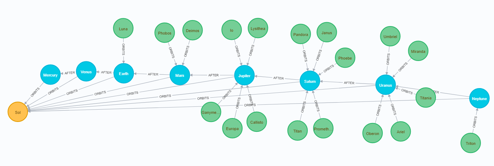

# Neo4j Solar System

This is a spike or prototype solution for loading data into Neo4j from a Spring Boot Java application.

```cypher
MATCH (n) RETURN n;
```

</img>

## The maven file `pom.xml`

`pom.xml` has these lines to bring in libraries relevant to Neo4j.

```xml
		<dependency>
			<groupId>org.springframework.boot</groupId>
			<artifactId>spring-boot-starter-data-neo4j</artifactId>
		</dependency>
		
		<dependency>
			<groupId>org.neo4j</groupId>
			<artifactId>neo4j</artifactId>
			<version>3.2.9</version>
			<scope>runtime</scope>
		</dependency>
		<dependency>
			<groupId>org.neo4j</groupId>
			<artifactId>neo4j-ogm-embedded-driver</artifactId>
			<scope>test</scope>
		</dependency>
		<dependency>
			<groupId>org.neo4j</groupId>
			<artifactId>neo4j-ogm-bolt-driver</artifactId>
		</dependency>
		<dependency>
			<groupId>org.neo4j</groupId>
			<artifactId>neo4j-ogm-http-driver</artifactId>
		</dependency>
```

The following spring properties are required to connect to your Neo4j database.

```properties
spring.data.neo4j.uri=http://localhost:7474
spring.data.neo4j.username=neo4j
spring.data.neo4j.password=secret
```

## The application code

The code is similar to an RDBMS Spring JPA solution.  The main method is annotated with:

```java
@SpringBootApplication
@EnableNeo4jRepositories("com.github.oliverpavey")
```

Each entity is annotated with `@NodeEntity` and each repository interface extends `Neo4jRepository`.

# References

These articles (and the Video in the first article) were useful in creating this project.

- [Neo4j Blog - A Big Step Forward: Spring Data Neo4j 5.0 Release](https://neo4j.com/blog/spring-data-neo4j-5-0-release/)
- [Spring into Neo4j with Spring Data 5, Spring Boot 2, and Neo4j!](https://medium.com/neo4j/spring-into-neo4j-with-spring-data-5-spring-boot-2-and-neo4j-3962fb1ea067)
 